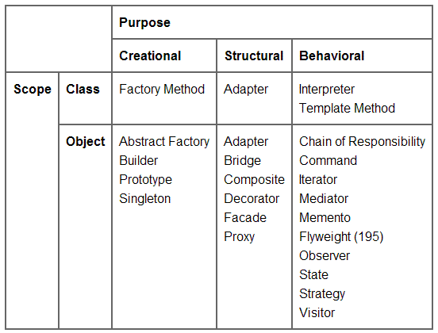

# Design Patterns

In software engineering, a software design pattern is a general, reusable solution to a commonly occurring problem within a given context in software design. It is not a finished design that can be transformed directly into source or machine code. Rather, it is a description or template for how to solve a problem that can be used in many different situations. Design patterns are formalized best practices that the programmer can use to solve common problems when designing an application or system.

Object-oriented design patterns typically show relationships and interactions between classes or objects, without specifying the final application classes or objects that are involved. Patterns that imply mutable state may be unsuited for functional programming languages, some patterns can be rendered unnecessary in languages that have built-in support for solving the problem they are trying to solve, and object-oriented patterns are not necessarily suitable for non-object-oriented languages.

Design patterns may be viewed as a structured approach to computer programming intermediate between the levels of a programming paradigm and a concrete algorithm.

<h2>Advantages of Design Patterns</h2>
- Tried & Tested 
- Highly Flexible 
- Language Neutral 

<h2>Types of Design Patterns</h2>
1. Creational [Class / Object creation] 
2. Structural [Class / Object composition] 
3. Behavioural [Class / Object communication]  

<h2>Antidesign Pattern</h2>
How to distinguish an actual anti pattern from bad habit,bad practise or bad idea?  
1. A common use process,structure or pattern that initially appearing to be appropriate & effective has more bad consequences than good ones. 
2. Another solution exist that is documented, repeatable & proven to be effective. 

<h2>Actions that result in turning design pattern to anti design pattern</h2>
1. Premature Optimization : Optimising before you have enough info to make educated conclusion about where & how to do optimization.  
2. Bike shedding : Tendency to spend excessive amounts of time debating & deciding on trival & often subjective issues.  
3. Analysis Paralysis : Over analysing to point that it prevents action & progress.  
4. God Class : Classes that control many other classes & have many dependencies & lots of responsibilities.  
5. Fear of adding classes : Belief that more classes make design more complicated, leading to fear of adding more classes or breaking into smaller classes.  
6. Inner platform effect : Tendency for complex software system to re-implement features of platform they run in or in programming language they are implemented usually poor.  
7. Magic Numbers & Strings : Using unnamed number or string literals instead of named constants.  
8. Management by numbers : Reliance on numbers for decision making.  
9. Useless Classes : Classes with no responsibility of their own or just invoke methods in another class or add an unneeded layer of abstraction. 