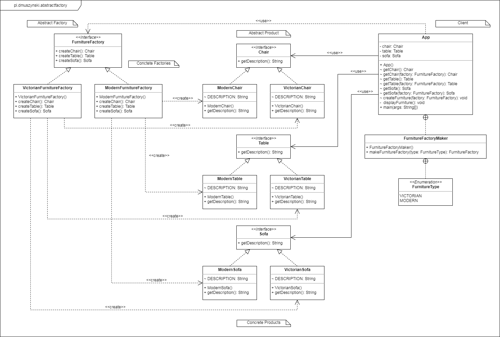

# Abstract Factory

| Layout         | Title            | Module           | Category        | Tags |
|:--------------:|:----------------:|:----------------:|:---------------:|:----:|
| Design Pattern | Abstract Factory | abstract-factory | Creational      | GoF  |

<h2>Description</h2>
The abstract factory pattern provides a way to encapsulate a group of individual factories that have a common theme without specifying their concrete classes. In normal usage, the client software creates a concrete implementation of the abstract factory and then uses the generic interface of the factory to create the concrete objects that are part of the theme. The client doesn't know (or care) which concrete objects it gets from each of these internal factories, since it uses only the generic interfaces of their products. This pattern separates the details of implementation of a set of objects from their general usage and relies on object composition, as object creation is implemented in methods exposed in the factory interface.<br><br>

<p align="center">
    
</p>

<h2>Program example</h2>
The following program is an implementation abstract factory
used for the production of modern and Victorian furniture (chair, sofa and table).

<br>Abstract product
```java
public interface Chair {
    String getDescription();
}
public interface Sofa {
    String getDescription();
}
public interface Table {
    String getDescription();
}
```
Concrete product
```java
// Modern furniture implementations 
public class ModernChair implements Chair {
    static final String DESCRIPTION = "This is a modern chair";
    @Override
    public String getDescription() {
        return DESCRIPTION;
    }
}
public class ModernSofa implements Sofa{
    static final String DESCRIPTION = "This is a modern sofa";
    @Override
    public String getDescription() {
        return DESCRIPTION;
    }
}
public class ModernTable implements Table{
    static final String DESCRIPTION = "This is a modern table";
    @Override
    public String getDescription() {
        return DESCRIPTION;
    }
}

// Victorian furniture implementations 
public class VictorianChair implements Chair {
    static final String DESCRIPTION = "This is a victorian chair";
    @Override
    public String getDescription() {
        return DESCRIPTION;
    }
}
public class VictorianSofa implements Sofa{
    static final String DESCRIPTION = "This is a victorian sofa";
    @Override
    public String getDescription() {
        return DESCRIPTION;
    }
}
public class VictorianTable implements Table{
    static final String DESCRIPTION = "This is a victorian table";
    @Override
    public String getDescription() {
        return DESCRIPTION;
    }
}
```
Abstract factory
```java
public interface FurnitureFactory {
    Chair createChair();
    Table createTable();
    Sofa createSofa();
}
```

Concrete factory
```java
// Modern furniture factory implementations 
public class ModernFurnitureFactory implements FurnitureFactory{
    @Override
    public Chair createChair() {
        return new ModernChair();
    }
    @Override
    public Table createTable() {
        return new ModernTable();
    }
    @Override
    public Sofa createSofa() {
        return new ModernSofa();
    }
}

// Victorian furniture factory implementations 
public class VictorianFurnitureFactory implements FurnitureFactory {
    @Override
    public Chair createChair() {
        return new VictorianChair();
    }
    @Override
    public Table createTable() {
        return new VictorianTable();
    }
    @Override
    public Sofa createSofa() {
        return new VictorianSofa();
    }
}
```
Client
```java
static class FurnitureFactoryMaker {

    public enum FurnitureType {
        VICTORIAN, MODERN
    }

    static FurnitureFactory makeFurnitureFactory(FurnitureType type) {
        switch (type) {
            case VICTORIAN:
                return new VictorianFurnitureFactory();
            case MODERN:
                return new ModernFurnitureFactory();
            default:
                throw new IllegalArgumentException("FurnitureType not supported.");
        }
    }
}

public static void main(String[] args) {
    App app = new App();

    System.out.println("Victorian Furniture");
    app.createFurniture(new VictorianFurnitureFactory());
    app.displayFurniture();

    System.out.println("Modern Furniture");
    app.createFurniture(new ModernFurnitureFactory());
    app.displayFurniture();
}
```

<h2>Class Diagram</h2>


<h2>Applicability</h2>

Use the Abstract Factory pattern when

- a system should be independent of how its products are created, composed and represented
- a system should be configured with one of multiple families of products
- a family of related product objects is designed to be used together, and you need to enforce this constraint
- you want to provide a class library of products, and you want to reveal just their interfaces, not their implementations
- the lifetime of the dependency is conceptually shorter than the lifetime of the consumer.
- you need a run-time value to construct a particular dependency
- you want to decide which product to call from a family at runtime.
- you need to supply one or more parameters only known at run-time before you can resolve a dependency.
- when you need consistency among products
- you don’t want to change existing code when adding new products or families of products to the program.

<h2>Consequences</h2>

- Dependency injection in java hides the service class dependencies that can lead to runtime errors that would have been caught at compile time.
- While the pattern is great when creating predefined objects, adding the new ones might be challenging.
- The code may become more complicated than it should be, since a lot of new interfaces and classes are introduced along with the pattern.

