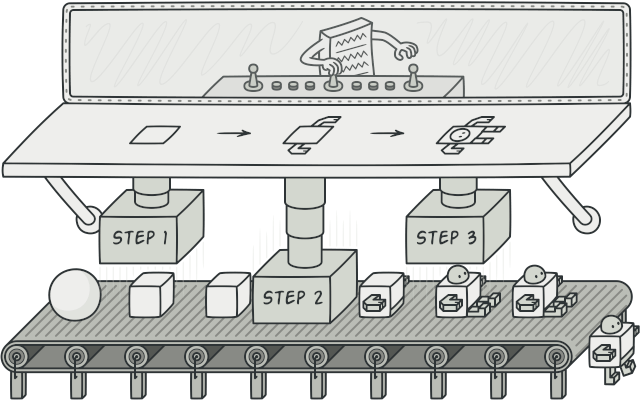

# Builder

| Layout         | Title          | Module         | Category        | Tags                |
|:--------------:|:--------------:|:--------------:|:---------------:|:-------------------:|
| Design Pattern | Builder        | builder        | Creational      | Gang of Four (GoF)  |

<h2>Description</h2>
The builder pattern is a design pattern designed to provide a flexible solution to various object creation problems in object-oriented programming. The intent of the Builder design pattern is to separate the construction of a complex object from its representation. It is one of the Gang of Four design patterns.  

    

<h2>Program example</h2>

<h2>Class Diagram</h2>

<h2>Applicability</h2>

Use the Builder pattern when

- the algorithm for creating a complex object should be independent of the parts that make up the object and how they're assembled
- the construction process must allow different representations for the object that's constructed

<h2>Consequences</h2>

Here are key consequences of the Builder pattern:

- It lets you vary a product's internal representation. The Builder object provides the director with an abstract interface for constructing the product. The interface lets the builder hide the representation and internal structure of the product. It also hides how the product gets assembled. Because the product is constructed through an abstract interface, all you have to do to change the product's internal representation is define a new kind of builder.

- It isolates code for construction and representation. The Builder pattern improves modularity by encapsulating the way a complex object is constructed and represented. Clients needn't know anything about the classes that define the product's internal structure; such classes don't appear in Builder's interface.

- Each ConcreteBuilder contains all the code to create and assemble a particular kind of product. The code is written once; then different Directors can reuse it to build Product variants from the same set of parts. 

- It gives you finer control over the construction process. Unlike creational patterns that construct products in one shot, the Builder pattern constructs the product step by step under the director's control. Only when the product is finished does the director retrieve it from the builder. Hence the Builder interface reflects the process of constructing the product more than other creational patterns. This gives you finer control over the construction process and consequently the internal structure of the resulting product.

