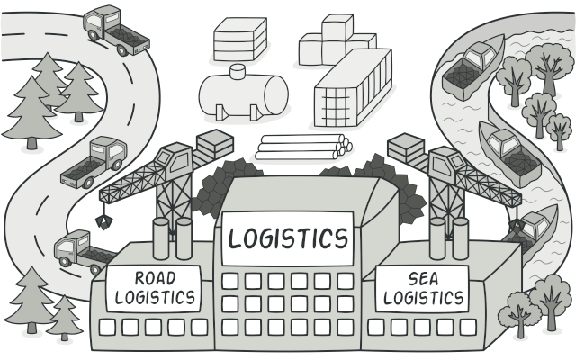

# Factory Method

| Layout         | Title          | Module         | Category        | Tags                |
|:--------------:|:--------------:|:--------------:|:---------------:|:-------------------:|
| Design Pattern | Factory Method | factory-method | Creational      | Gang of Four (GoF)  |

<h2>Description</h2>
In class-based programming, the factory method pattern is a creational pattern that uses factory methods to deal with the problem of creating objects without having to specify the exact class of the object that will be created. This is done by creating objects by calling a factory method—either specified in an interface and implemented by child classes, or implemented in a base class and optionally overridden by derived classes—rather than by calling a constructor.<br><br>

<p align="center">
    
</p>

<h2>Program example</h2>
The following program is an implementation abstract factory pattern
used for the production of modern and Victorian furniture (chair, sofa and table).

<br>Abstract product - furniture interfaces.
```java
public interface Chair {
    String getDescription();
}
public interface Sofa {
    String getDescription();
}
public interface Table {
    String getDescription();
}
```
Concrete product - classes representing specific furniture, that implement the corresponding interfaces.
```java
// Modern furniture implementations 
public class ModernChair implements Chair {
    static final String DESCRIPTION = "This is a modern chair";
    @Override
    public String getDescription() {
        return DESCRIPTION;
    }
}
public class ModernSofa implements Sofa{
    static final String DESCRIPTION = "This is a modern sofa";
    @Override
    public String getDescription() {
        return DESCRIPTION;
    }
}
public class ModernTable implements Table{
    static final String DESCRIPTION = "This is a modern table";
    @Override
    public String getDescription() {
        return DESCRIPTION;
    }
}

// Victorian furniture implementations 
public class VictorianChair implements Chair {
    static final String DESCRIPTION = "This is a victorian chair";
    @Override
    public String getDescription() {
        return DESCRIPTION;
    }
}
public class VictorianSofa implements Sofa{
    static final String DESCRIPTION = "This is a victorian sofa";
    @Override
    public String getDescription() {
        return DESCRIPTION;
    }
}
public class VictorianTable implements Table{
    static final String DESCRIPTION = "This is a victorian table";
    @Override
    public String getDescription() {
        return DESCRIPTION;
    }
}
```
Abstract factory - furniture factory interface that allows us to create a family of related objects.
```java
public interface FurnitureFactory {
    Chair createChair();
    Table createTable();
    Sofa createSofa();
}
```

Concrete factory - classes representing specific furniture that implement appropriate interfaces.
```java
// Modern furniture factory implementations 
public class ModernFurnitureFactory implements FurnitureFactory{
    @Override
    public Chair createChair() {
        return new ModernChair();
    }
    @Override
    public Table createTable() {
        return new ModernTable();
    }
    @Override
    public Sofa createSofa() {
        return new ModernSofa();
    }
}

// Victorian furniture factory implementations 
public class VictorianFurnitureFactory implements FurnitureFactory {
    @Override
    public Chair createChair() {
        return new VictorianChair();
    }
    @Override
    public Table createTable() {
        return new VictorianTable();
    }
    @Override
    public Sofa createSofa() {
        return new VictorianSofa();
    }
}
```
Client -  The client can use FurnitureFactoryMaker to create the desired concrete factory which, in turn, will produce different concrete objects (Chair, Sofa, Table). In this example, we also used an enum to parameterize which type of kingdom factory the client will ask for.
```java
static class FurnitureFactoryMaker {

    public enum FurnitureType {
        VICTORIAN, MODERN
    }

    static FurnitureFactory makeFurnitureFactory(FurnitureType type) {
        switch (type) {
            case VICTORIAN:
                return new VictorianFurnitureFactory();
            case MODERN:
                return new ModernFurnitureFactory();
            default:
                throw new IllegalArgumentException("FurnitureType not supported.");
        }
    }
}

public static void main(String[] args) {
    App app = new App();

    System.out.println("Victorian Furniture");
    app.createFurniture(new VictorianFurnitureFactory());
    app.displayFurniture();

    System.out.println("Modern Furniture");
    app.createFurniture(new ModernFurnitureFactory());
    app.displayFurniture();
}
```

<h2>Class Diagram</h2>


<h2>Applicability</h2>

Use the Factory Method pattern when

- you don’t know beforehand the exact types and dependencies of the objects your code should work with.
- you want to provide users of your library or framework with a way to extend its internal components.
- you want to save system resources by reusing existing objects instead of rebuilding them each time.


<h2>Consequences</h2>

- Creating objects in the class using the factory method always gives you more flexibility than generating them directly. The factory method pattern provides anchor points for subclasses for creating an enhanced version of objects.
- 

